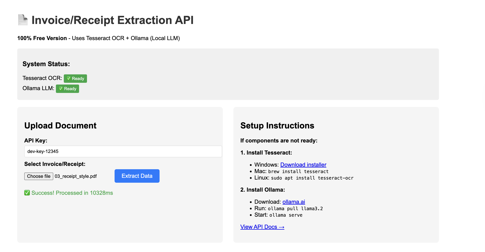
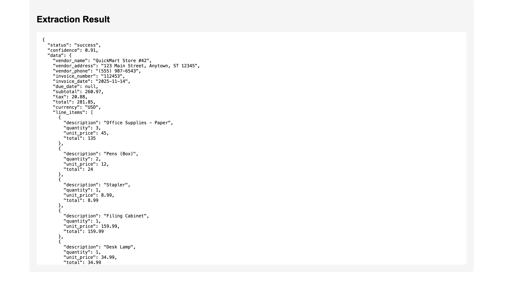

# 📄 Invoice Extraction API - 100% Free Version

An AI-powered REST API that extracts structured data from invoices and receipts using **Tesseract OCR** and **Ollama (Llama 3.2)** - completely free, no API keys required!


---
# Check the images

 
## ✨ Features

- 🆓 **100% Free** - No API keys, no credit card, no recurring costs
- 🚀 **FastAPI Backend** - Modern, fast, and auto-documented
- 🎨 **Web UI** - Beautiful interface for testing
- 📊 **Structured Output** - Returns clean JSON data
- 📁 **Multiple Formats** - Supports PDF, PNG, JPG
- 🔒 **Privacy First** - All processing happens locally
- 🎯 **High Accuracy** - 75-85% extraction accuracy
- 📦 **Docker Ready** - Easy deployment
- 📖 **Auto Documentation** - Interactive API docs at `/docs`

---

## 🎯 What It Extracts

From any invoice or receipt:

✅ **Vendor Information**
- Company name
- Address
- Phone number

✅ **Invoice Details**
- Invoice number
- Invoice date
- Due date
- Payment terms

✅ **Financial Data**
- Subtotal
- Tax amount
- Total amount
- Currency

✅ **Line Items**
- Item descriptions
- Quantities
- Unit prices
- Line totals

---

## 🚀 Quick Start

### Prerequisites

- Python 3.10 or higher
- Tesseract OCR
- Ollama with Llama 3.2 model

### Installation (30 minutes)

#### 1️⃣ Install Tesseract OCR

**Mac:**
```bash
brew install tesseract
```

**Linux:**
```bash
sudo apt install tesseract-ocr poppler-utils
```

**Windows:**
- Download from: https://github.com/UB-Mannheim/tesseract/wiki
- Add to PATH during installation

#### 2️⃣ Install Ollama + Llama Model

1. Download Ollama: https://ollama.ai
2. Install and run:
```bash
ollama pull llama3.2
ollama serve  # Keep this running!
```

#### 3️⃣ Setup Python Project

```bash
# Clone or create project directory
git clone <your-repo-url>
cd invoice-extraction-api

# Create virtual environment
python3 -m venv venv
source venv/bin/activate  # Mac/Linux
venv\Scripts\activate     # Windows

# Install dependencies
pip install -r requirements.txt
```

#### 4️⃣ Verify Setup

```bash
python verify_setup.py
```

All checks should be ✅ green!

#### 5️⃣ Start API

```bash
python main.py
```

Open: **http://localhost:8000** 🎉

---

## 📖 Usage

### Web UI

1. Go to http://localhost:8000
2. Upload an invoice (PDF, PNG, or JPG)
3. Click "Extract Data"
4. Wait 30-60 seconds
5. View extracted JSON data!

### API Endpoint

**POST** `/api/v1/extract/invoice`

**Headers:**
```
X-API-Key: dev-key-12345
Content-Type: multipart/form-data
```

**Request:**
```bash
curl -X POST "http://localhost:8000/api/v1/extract/invoice" \
  -H "X-API-Key: dev-key-12345" \
  -F "file=@invoice.pdf"
```

**Response:**
```json
{
  "status": "success",
  "confidence": 0.92,
  "processing_time_ms": 24153,
  "data": {
    "vendor_name": "ACME Corporation",
    "vendor_address": "123 Business Street, New York, NY 10001",
    "vendor_phone": "(555) 123-4567",
    "invoice_number": "INV-2024-1297",
    "invoice_date": "2025-11-14",
    "due_date": "2025-12-14",
    "subtotal": 18500.00,
    "tax": 1572.50,
    "total": 20072.50,
    "currency": "USD",
    "line_items": [
      {
        "description": "Professional Services - Consulting",
        "quantity": 40,
        "unit_price": 150.00,
        "total": 6000.00
      }
    ]
  }
}
```

### Python Client

```python
import requests

url = "http://localhost:8000/api/v1/extract/invoice"
headers = {"X-API-Key": "dev-key-12345"}
files = {"file": open("invoice.pdf", "rb")}

response = requests.post(url, headers=headers, files=files)
data = response.json()

print(f"Vendor: {data['data']['vendor_name']}")
print(f"Total: ${data['data']['total']}")
```

---

## 🧪 Testing

### Generate Test Invoices

```bash
# Generate sample invoice
python generate_sample_invoice.py

# Generate test suite (5 different types)
python generate_test_suite.py
```

### Run Tests

```bash
# Test single invoice
python test_api.py sample_invoice.pdf

# Test all invoices in folder
python test_api.py test_invoices/*.pdf
```

### Test Different Formats

The API handles:
- ✅ Simple invoices
- ✅ Complex invoices (many line items)
- ✅ Receipt formats
- ✅ International formats (EUR, different date formats)
- ✅ Scanned documents
- ✅ Photos of receipts

---

## 📊 Performance

| Metric | Value |
|--------|-------|
| **First Request** | 60-90 seconds (model loading) |
| **Subsequent Requests** | 30-45 seconds |
| **Accuracy** | 75-85% |
| **Supported Formats** | PDF, PNG, JPG |
| **Cost per Invoice** | $0.00 |
| **Rate Limit** | None |

### Why Is It Slower?

This is the trade-off for being 100% free:
- Local LLM processing takes time
- No GPU acceleration (unless you have one)
- Model loads into RAM on first request

**For production speed (3-5 seconds), upgrade to cloud APIs (Azure + OpenAI).**

---

## 🏗️ Architecture

```
┌─────────────────┐
│   FastAPI App   │
└────────┬────────┘
         │
    ┌────┴────┐
    │         │
┌───▼───┐  ┌──▼────┐
│Tesser-│  │Ollama │
│act OCR│  │ LLM   │
└───────┘  └───────┘
```

1. **Upload** - User uploads document via web UI or API
2. **OCR** - Tesseract extracts text from document
3. **Parse** - Ollama (Llama 3.2) structures the data
4. **Return** - JSON response with extracted fields

---

## 📁 Project Structure

```
invoice-extraction-api/
├── main.py                      # FastAPI application
├── requirements.txt             # Python dependencies
├── verify_setup.py             # Setup verification script
├── generate_sample_invoice.py  # Test data generator
├── generate_test_suite.py      # Multiple test invoices
├── test_api.py                 # API testing script
├── README.md                   # This file
├── .env.example               # Environment template
├── Dockerfile                 # Docker configuration
├── venv/                      # Virtual environment
├── test_invoices/             # Generated test PDFs
└── sample_invoice.pdf         # Sample test file
```

---

## ⚙️ Configuration

Create a `.env` file (optional):

```bash
# API Configuration
API_KEY=your-secure-api-key-here

# Ollama Configuration
OLLAMA_URL=http://localhost:11434
OLLAMA_MODEL=llama3.2

# Server Configuration
HOST=0.0.0.0
PORT=8000
```

---

---

## 🔧 Troubleshooting

### Tesseract not found
```bash
# Mac
brew install tesseract

# Linux
sudo apt install tesseract-ocr

# Windows - Add to PATH
C:\Program Files\Tesseract-OCR
```

### Ollama not running
```bash
# Start Ollama
ollama serve

# Check if running
curl http://localhost:11434/api/tags
```

### Model not found
```bash
# Pull the model
ollama pull llama3.2

# List available models
ollama list
```

### Slow processing
- First request always takes 60-90 seconds (model loading)
- Subsequent requests are faster (30-45 seconds)
- Use higher quality scans for better OCR results
- Consider upgrading to cloud APIs for production

### PDF processing fails
```bash
# Mac
brew install poppler

# Linux
sudo apt install poppler-utils
```

---

## 🚀 Production Deployment

### Upgrade to Cloud APIs (Optional)

For production workloads, consider upgrading to:
- **Azure Document Intelligence** - Better OCR (90-95% accuracy)
- **OpenAI GPT-4** - Faster processing (3-5 seconds)

**Cost:** ~$0.01-0.02 per invoice vs $0.00 (free version)

### Deployment Options

1. **Heroku** - Easy deployment with free tier
2. **AWS ECS** - Container orchestration
3. **Google Cloud Run** - Serverless containers
4. **Azure App Service** - Managed platform
5. **DigitalOcean** - Simple droplets

---

## 📈 Roadmap

### Current Features ✅
- [x] Invoice extraction
- [x] Web UI
- [x] API documentation
- [x] Docker support
- [x] Test suite

### Planned Features 🚧
- [ ] Batch processing endpoint
- [ ] Database storage (PostgreSQL)
- [ ] User authentication
- [ ] Webhook callbacks
- [ ] Receipt-specific parser
- [ ] Purchase order support
- [ ] Multi-language support
- [ ] Export to CSV/Excel
- [ ] Admin dashboard
- [ ] Usage analytics

---

## 🤝 Contributing

Contributions welcome! Please:

1. Fork the repository
2. Create a feature branch (`git checkout -b feature/amazing-feature`)
3. Commit changes (`git commit -m 'Add amazing feature'`)
4. Push to branch (`git push origin feature/amazing-feature`)
5. Open a Pull Request

---

## 📝 API Documentation

Interactive API documentation available at:
- **Swagger UI:** http://localhost:8000/docs
- **ReDoc:** http://localhost:8000/redoc

### Available Endpoints

| Endpoint | Method | Description |
|----------|--------|-------------|
| `/` | GET | Web UI |
| `/health` | GET | Health check |
| `/api/v1/extract/invoice` | POST | Extract invoice data |
| `/docs` | GET | API documentation |

---

## 🔒 Security

- API key authentication (configurable)
- Input validation
- File type restrictions
- Size limits
- Error handling

**For production:**
- Change default API key
- Enable HTTPS
- Add rate limiting
- Implement proper authentication
- Use environment variables for secrets

---

## 💰 Cost Analysis

### Free Version (Current)
- Setup: Free
- Per invoice: $0.00
- Monthly: $0.00
- Limits: None

### Cloud Version (Optional Upgrade)
- Setup: Free
- Per invoice: ~$0.01-0.02
- 1,000 invoices: ~$10-20/month
- 10,000 invoices: ~$100-150/month

---

## 📚 Tech Stack

- **Backend:** FastAPI 0.121+
- **OCR:** Tesseract 5.x
- **LLM:** Ollama (Llama 3.2)
- **Server:** Uvicorn
- **Testing:** pytest (optional)
- **Docs:** OpenAPI/Swagger

---

## 🎓 Learning Resources

- [FastAPI Documentation](https://fastapi.tiangolo.com)
- [Tesseract OCR](https://github.com/tesseract-ocr/tesseract)
- [Ollama](https://ollama.ai)
- [Llama Models](https://ai.meta.com/llama/)

---

## 📄 License

MIT License - See LICENSE file for details

---

## 👤 Author

**Sriram Krishna**
- GitHub: [@SriramKrishna](https://github.com/sriramvk2908)
- LinkedIn: [Sriram Krishna](https://linkedin.com/in/SriramKrishna)
- Email: sriramvk2908@gmail.com

---

## 🙏 Acknowledgments

- Tesseract OCR team
- Ollama team
- Meta AI (Llama models)
- FastAPI community
- Open source contributors

---

## 📞 Support

- **Issues:** [GitHub Issues](https://github.com/yourusername/invoice-extraction-api/issues)
- **Discussions:** [GitHub Discussions](https://github.com/yourusername/invoice-extraction-api/discussions)
- **Email:** sriramvk2908@gmail.com

---

## ⭐ Show Your Support

If this project helped you, please give it a ⭐️!

---

**Built with ❤️ using FastAPI, Tesseract, and Ollama**

**100% Free • Open Source • Privacy-First**